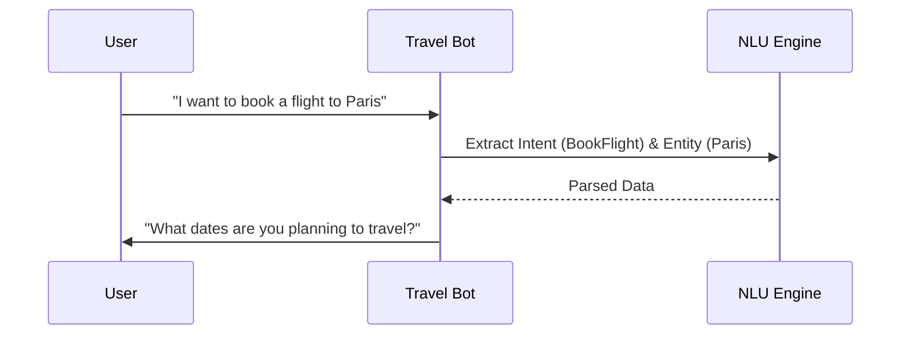

# ✈️ Traveler Booking Bot

An intelligent conversational bot designed to handle travel booking workflows, itineraries, and user queries.

## 🏗 Architecture
The core logic resides within the `traveler-booking-bot-master` directory, designed to process natural language related to travel.
- **NLU Engine**: Parses dates, destinations, and preferences from user input.
- **Booking Flow**: A state-machine driven conversation handler ensuring all mandatory booking details are collected.



## 🚀 Execution
1. Navigate to the core directory:
   ```bash
   cd traveler-booking-bot-master
   ```
2. Follow the specific setup scripts within the master folder to initialize the bot.
